# Progetto TSP

## TSP con finestre temporali (TS-TW):
* A partire dalla base (nodo 0) un tecnico deve rifornire n vending machines poste in n siti diversi, e rientrare alla base.
* Ogni sito i apre al tempo 𝑡_𝑖:
* Se si arriva prima occorre attendere fino all’apertura;
* Se si arriva al tempo 𝑡_𝑗>𝑡_𝑖 si paga una penale di (𝑡_𝑗−𝑡_𝑖).
* Noti i tempi di percorrenza da sito a sito e alla base, si determini il tour di costo minimo (durata + penalità) che visita tutti i siti e la base, partendo al tempo 𝑡_0.

## Travelling Salesman Problem (TSP)

Il problema del commesso viaggiatore (TSP – Traveling Salesman Problem) è un problema combinatorio classico noto per essere NP-hard, ovvero non esiste alcun algoritmo noto in grado di risolverlo in tempo polinomiale in tutti i casi. L’obiettivo del TSP consiste nel trovare il ciclo hamiltoniano di costo minimo che visiti ciascun nodo esattamente una volta.

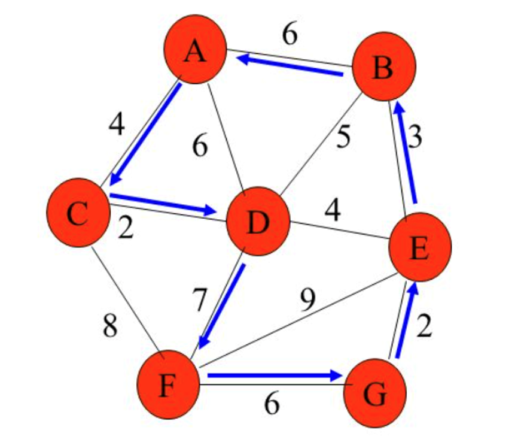

 
Nel problema del commesso viaggiatore con tempi di apertura, ogni nodo 𝑖 i può essere visitato solo a partire da un determinato istante di apertura 𝑡_𝑖.

Questo vincolo temporale aggiuntivo complica ulteriormente il problema.

Infatti, se un nodo viene raggiunto prima del suo tempo di apertura, il commesso deve attendere, introducendo periodi di inattività (**idle time**) che incidono sull’efficienza complessiva del tour.

Dal punto di vista della teoria della complessità, il TSP con tempi di apertura rimane NP-hard come il TSP classico, ma nella pratica risulta più difficile da risolvere per via dei vincoli temporali.

## Struttura del progetto

Questo progetto implementa e confronta diverse strategie di risoluzione del **Travelling Salesman Problem (TSP)**.
Il seguente codice è organizzato in moduli che permettono di:
- Generare istanze del problema
- Applicare algoritmi greedy
- Applicare tecniche di local search
- Applicare varianti di tabu search
- Applicare una iterated local search
- Visualizzare graficamente le soluzioni

## Algoritmi implementati

Nel progetto vengono illustrate le seguenti procedure:

#### Greedy (3 procedure)
1. `greedy_minimum_opening_time`  
2. `greedy_minimum_distance_from_zero`  
3. `nn_greedy`  

#### Local Search (3 procedure)
1. `LS_swap_adjacent`  
2. `LSH_city_insert`
3. `LSH_city_insertT`

#### Tabu Search (2 procedure)
1. `information_guided_tabu_searchAR`  
2. `tabu_search_city_insertAR`  

#### Iterated Local Search (1 procedura)
1. `iterated_local_search`  

## Spiegazione dei vari moduli/algoritmi

- **Generazione istanze TSP**   

  La funzione generate_tsp_instance, genera un’istanza e ha i seguenti parametri:
  * n : numero di nodi
  * max_coordinate : Valore coordinate massimo
  * max_opening_time : valore massimo apertura nodo
  * seed_coordinates : seme per generazione casuale e ripetibile delle coordinate
  * seed_opening_times : seme per generazione casuale e ripetibile dei tempi di apertura dei nodi
---
- **Visualizzazione**   

  Funzioni per stampare le istanze e rappresentarle graficamente:
  - `plot_tsp_nodes`: visualizza solo i nodi
  - `plot_tsp_nodes_link`: visualizza nodi e collegamenti con frecce
  - `call_greedy`: esegue un algoritmo greedy sull'istanza passata e ne stampa il grafico
  - `compare_greedy`: esegue tutti gli algoritmi greedy sulla stessa istanza e stampa un'unica figura che mostra i risultati.
  - `call_LocalSearch`: applica l'algoritmo local search passato come parametro partendo da una soluzione greedy. Stampa una figura con il risultato della greedy iniziale, il risultato della local search e la progressione del valore della funzione obbiettivo.
  - `call_tabu_searchA`: applica l'algoritmo tabu 
  search passato come parametro partendo da una 
  soluzione iniziale (solitamente greedy). 
  Stampa una figura con il risultato
  dell'algoritmo iniziale, il risultato della tabu 
  search e la progressione del valore della funzione 
  obbiettivo.
---
- **Algoritmi Greedy** 

  <u>**DEFINIZIONE:**</u>

  Gli algoritmi greedy (voraci) determinano la soluzione 
  attraverso una sequenza di decisioni parziali (localmente 
  ottime), senza mai modificare le decisioni gia prese.

  Sono di facile implementazione e notevole efficienza 
  computazionale ma, sia pure con alcune eccezioni di 
  notevole rilievo, non garantiscono l'ottimalità, e a volte 
  neppure l’ammissibilità della soluzione prodotta.

  <u>**PROCEDURA GREEDY (TEMPLATE):**</u>

  E (ground set) è l'insieme degli elementi che compongono le soluzione del problema.

  F (feasible region/regione ammissibile). 

  * Soluzione iniziale S0=∅, 
  * Ad ogni step k - seleziona ek come l’elemento di E più promettente (criterio best) tra quelli non ancora esaminati, - valuta se la soluzione parziale Sk ∪ ek ∈ F (test di indipendenza o di ammissibilità delle soluzioni parziali) 
  * In caso positivo, estendi Sk con Sk ∪ ek (Sk+1:=Sk∪ek) altrimenti Sk+1:=Sk
  * Se si è esaminato tutto E o se Sk è massimale, termina restituendo Sn = Sk
  * Altrimenti Itera 

   

  <u>**ALGORITMI GREEDY IMPLEMENTATI:**</u>

  1. **greedy_minumum_opening_time** costruisce una soluzione eseguendo le seguenti operazioni:
      * Ordina i nodi dell'istanza, in ordine non decrescente, in base all'opening_time di ciascun nodo.
      * Seleziona un nodo alla volta dal vettore dei nodi ordinati e lo collega con il successivo.

  2. **greedy_minimum_distance_from_zero**
  costruisce una soluzione eseguendo le seguenti operazioni:
      * Ordina i nodi dell'istanza in base alla distanza crescent dalla base (nodo 0).
      * Seleziona un nodo alla volta dal vettore dei nodi ordinati e lo collega con il successivo.
  
  3. **greedy Nearest Node** costruisce una soluzione eseguendo le seguenti operazioni:
      * Seleziona, per ciascun nodo, il nodo adiacente più vicino.
      * Ad ogni passo, vengono identificati i nodi adiacenti e si sceglie quello con il costo minimo, aggiornando progressivamente la soluzione con decisioni localmente ottimali.

   
---
- **Local Search**

  <u>**DEFINIZIONE:**</u>

  Sono euristiche di **miglioramento**: 
  Occorre fornire loro una soluzione di partenza, prodotta utilizzando una delle euristiche costruttive viste in precedenza.
  Si dividono in euristiche single thread e multi thread (population based).

  La **local search** è la capostipite delle euristiche single thread ed è basata sul concetto di **intorno**.

  L’intorno è descritto attraverso la **mossa** che specifica operativamente cosa modificare della soluzione corrente e come farlo, per generare tutte le soluzioni del vicinato. 

  Restituisce un punto di **ottimo locale**, il primo individuato lungo la ricerca.

  Per superare questo limite, sono state proposte numerose strategie sempre basate sul concetto di intorno (Ricerca Tabù, Simulated Annealing, Iterated Local Search,Variable Neighboorhood Search, Grasp, etc.) che possono essere ibridizzate fra loro per dare luogo a nuovi algoritmi.

  <u>**PROCEDURA LOCAL SEARCH:**</u>

  * Ad ogni iterazione k-esima si tratta di risolvere un problema di ottimizzazione ristretto all’intorno **N(xk)** della soluzione corrente **xk**. 
  * La procedura **Local Search** restituisce una qualsiasi soluzione **x*** migliore di **xk** nell’insieme **N(xk)** se questa esiste, ma non necessariamente la migliore soluzione in **N(xk)**.

    Quindi il problema di ottimizzazione che si risolve ad ogni iterazione k-esima, non viene necessariamente risolto in modo esatto anche se ciò è possibile.

   

  <u>**ALGORITMI DI TIPO LOCAL SEARCH IMPLEMENTATI:**</u>

  1. **Swap Adjacent**  
  * Strategia: **First Improvement**, cerca di migliorare iterativamente una route scambiando due nodi adiacenti, privilegiando quelli con maggiore idle o tardiness  

    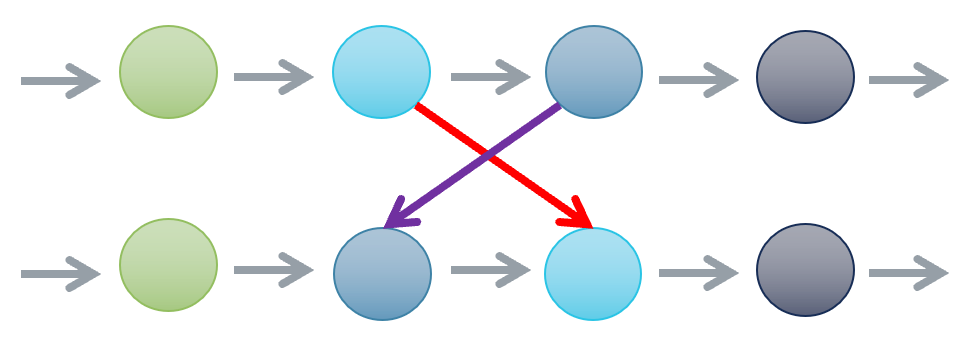

   

  2. **City Insert**
  * Strategia: **h Improvement** (la migliore delle h soluzioni che migliorano l'ottimo corrente).
  * La ricerca nell'intorno procede fino a determinare h miglioramenti.
  * Intorno ottenuto dalla cancellazione di 1 nodo nella route e dal suo reinserimento in un altro punto (partendo dall’inizio).
  * I nodi vengono cancellati a partire dalla fine della route.
  * Il nodo i viene reinserito nella posizione p solo se la sua distanza dal nodo precedente (p-1) o dal nodo iniziale è inferiore a quella del nodo attualmente presente in p.
  
    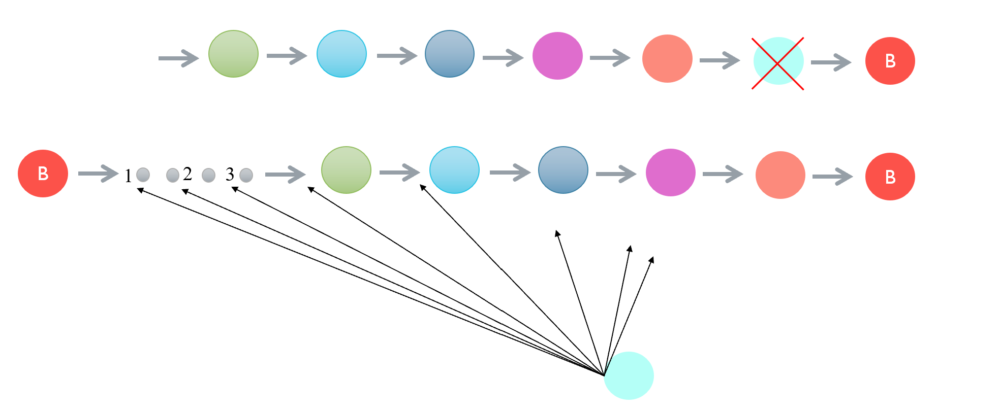

   

  3. **City Insert Tail**
  * Strategia: **h Improvement** (la migliore delle h soluzioni che migliorano l'ottimo corrente).
  * La ricerca nell'intorno procede fino a determinare h miglioramenti.
  * Intorno ottenuto dalla cancellazione di 1 nodo nella route e dal suo reinserimento in un altro punto (partendo dalla fine).
  * I nodi vengono cancellati a partire dalla fine della route.
  * Il nodo i viene reinserito nella posizione p solo se la sua distanza dal nodo precedente (p-1) o dal nodo iniziale è inferiore a quella del nodo attualmente presente in p.

    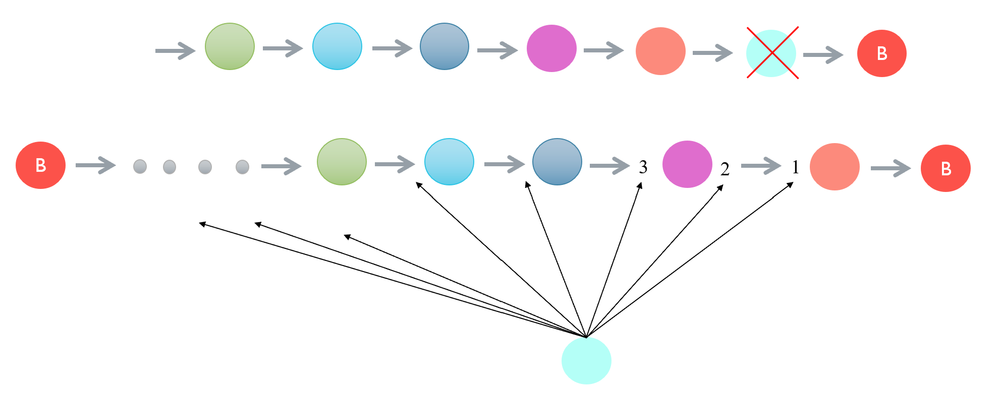
  
   

---
- **Tabu Search**

  <u>**DEFINIZIONE:**</u>

  Ad ogni iterazione si seleziona la miglior soluzione dell’intorno diversa dalla soluzione corrente e ,potenzialmente, peggiore se quella corrente è un ottimo locale.
  
  * La sequenza del valore delle soluzioni visitate non è più monotona, quindi occorre mantenere memoria della miglior soluzione visitata (ottimo candidato).
  * Ad ogni iterazione si memorizza in una lista tabu l’inversa della mossa appena effettuata, che resterà proibita per le prossime N (lunghezza lista tabù) iterazioni. 
  * Lo scopo è garantire che la mossa inversa della mossa m appena effettuata venga applicata solo su una soluzione ormai sostanzialmente diversa da quella originata dalla mossa m, in modo tale da non ricondurre la ricerca su soluzioni gia visitate.
  * Eccezioni: il criterio di aspirazione permette di visitare soluzioni tabù con valore di 
  funzione obiettivo migliore di quella dell’ottimo candidato (sono sicuramente 
  soluzioni mai visitate).
  * Criteri di STOP (come alternativa al raggiungimento dell’ottimo locale): 
  Stallo(=Massimo numero di passi senza miglioramenti), Massimo numero di iterazioni, Massimo numero di valutazioni della funzione obiettivo quando è costosa, 
  Massimo running time.

   

  <u>**ALGORITMI DI TIPO TABU SEARCH IMPLEMENTATI:**</u>

  1. **Information Guided**  
  * La funzione information_guided_tabu_searchA implementa una variante della Tabu Search per ottimizzare un percorso, spostando iterativamente i nodi in base a una priorità calcolata su idle_tardiness.
  * Tiene traccia delle soluzioni migliori evitando cicli grazie a una lista Tabu, ma consente eccezioni se si trova un miglioramento (criterio di aspirazione). 
  * Il processo termina dopo un numero definito di iterazioni senza miglioramenti. 
  * Restituisce il miglior percorso trovato e informazioni sull’evoluzione della ricerca.
  
   

  2. **City Insert**
  * La funzione tabu_search_city_insertA applica la Tabu Search rimuovendo e reinserendo nodi del percorso per esplorare soluzioni vicine.
  * Se una mossa è Tabu, può comunque essere accettata se migliora la soluzione ottima (criterio di aspirazione).
  * Il processo continua finché non si verificano troppi passi senza miglioramenti.
  * Restituisce il miglior percorso trovato e informazioni sull’evoluzione della ricerca.
  
 

---
- **Iterated Local Search**  

  <u>**DEFINIZIONE:**</u>

  Studi sperimentali hanno comprovato che per iI problemi di ottimizzazione combinatoria esistono numerosi ottimi locali di bassa qualità.

  Quindi è ragionevole cercare una strategia per continuare la ricerca anche dopo avere 
  determinate un ottimo locale.
  Ad esempio, iterando il procedimento a partire da un altro punto iniziale.

  Per fare questo, è stato ideato l'algoritmo chiamato **Iterated local search** che ha il seguente funzionamento:

  L’idea, è perturbare sufficientemente l’ottimo locale **x*** corrente ottenuto da una procedura LocalSearch, e riapplicare la stessa LocalSearch alla soluzione perturbata.

  Un check verifica la diversità del nuovo ottimo locale, dal precedente. 
  Data l’eventuale tolleranza al peggioramento della funzione obiettivo, si decide se accettare la nuova soluzione e iterare a partire da essa, oppure ripetere il procedimento a partire dal precedente ottimo 
  locale, riapplicando la perturbazione per generare il punto iniziale di una nuova LS.

   

  <u>**ALGORITMO DI TIPO ITERATED LOCAL SEARCH IMPLEMENTATO:**</u>

  **it_ls_information_guided:**

  Questa funzione implementa un algoritmo iterativo di ricerca locale guidata per ottimizzare una soluzione su una data istanza di problema.
  * Inizia generando una soluzione greedy e migliorandola tramite una procedura di LS (LS_swap_adjacent). 
  * Successivamente entra in un ciclo iterativo in cui perturba la soluzione corrente con una mossa di diversificazione e la migliora ulteriormente con la ricerca locale.  
  * La funzione tiene traccia dell’evoluzione della funzione obiettivo ad ogni iterazione e restituisce la migliore soluzione e il suo valore.

   

  <u>**MOSSA DI DIVERSIFICAZIONE:**</u>

    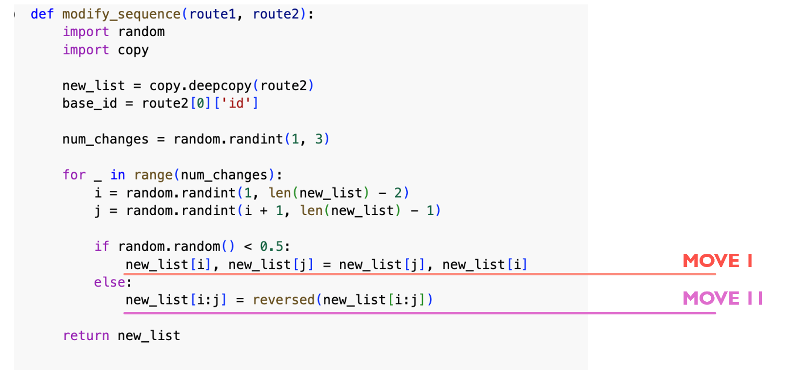

     

    Come evidenziato nell'immagine la mossa di diversificazione della procedura **Iterated local search** si compone, di fatto, di altre due sotto mosse che vengono applicate con probabilità randomica.

    In particolare la funzione **"modify_sequence"**, che si occupa di attuare la mossa, esegue i seguenti passi:

    * Fa una copia della route in ingresso per poterci lavorare in sicurezza.
    * Calcola un numero di iterazioni casuale da 1 a 3.
    * Per il numero di iterazioni calcolato, calcola un indice **i** casuale che può andare da 1 alla lunghezza della lista meno i due elementi finali.
    Calcola, poi, un indice **j** casuale che va da **i+1** alla lunghezza della lista escluso l'elemento finale.
    * Una volta fatti questi calcoli l'indice **j** sarà sicuramente più grande di **i** ed il primo e l'ultimo elemento della lista rimarranno invariati.
    * A questo punto viene estratto un numero casuale compreso tra zero e uno.
    * Se il numero appena estratto è più piccolo di 0.5 allora gli elementi della lista in posizione **i** e in posizione **j** vengono scambiati.
    * Se il numero estratto è maggiore o uguale di 0.5 allora la sotto sequenza che va da **i** a **j** viene invertita.
  
   

  <u>**VISUALIZZAZIONE GRAFICA DELLA MOSSA:**</u>
     

    Scambio degli elementi in posizione **i** e posizione **j**:

    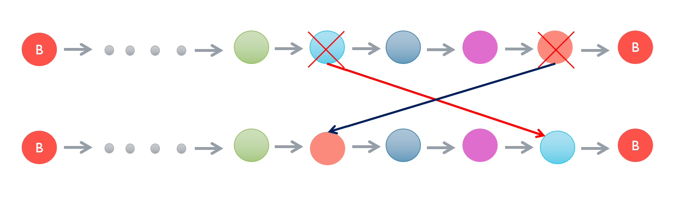

     

    Inversione della sotto sequenza identificata dagli indici **i** e **j**:

    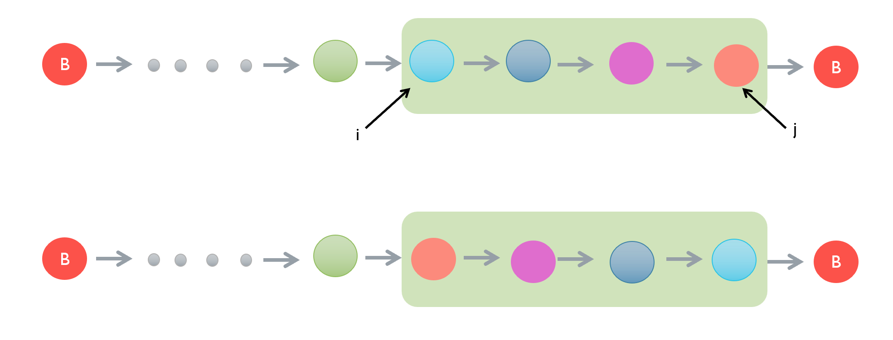

---

## SEZIONE DI TEST - INTEGRATION E UNIT TEST

**INTEGRATION TEST - exam_integration_test.py**

Questo test verifica l’intera pipeline di risoluzione di un problema TSP (Traveling Salesman Problem), controllando che i diversi algoritmi implementati funzionino correttamente e si integrino tra loro.
In particolare:
- **Generazione dell’istanza**
  - Crea un problema TSP con 20 città, coordinate casuali e tempi di apertura.
  - Controlla che l’istanza sia valida (numero di città, ID iniziale).

- **Algoritmi Greedy**
  - Applica tre strategie greedy.
  - Calcola l’obiettivo (costo del percorso) e verifica che i risultati siano consistenti e calcolati entro un tempo limite.

- **Local Search**
  - Parte da una soluzione greedy e applica varianti di ricerca locale (swap, insert, insertT).
  - Controlla che la soluzione rimanga valida, che il costo sia non negativo e che le mosse siano registrate correttamente.

- **Tabu Search**
  - Esegue due versioni di tabu search (city_insert, information_guided).
  - Verifica che vengano restituiti percorso, valore, soluzioni correnti e migliori, insieme alla lista tabu.

- **Iterated Local Search (ILS)**
  - Applica una ricerca locale iterata con massimo 60 iterazioni.
  - Controlla che la soluzione finale sia valida e che il costo sia corretto.

Il test dimostra che tutti i moduli dell’algoritmo TSP (generazione istanza, greedy, local search, tabu search, ILS) funzionano correttamente quando integrati in un’unica pipeline, garantendo coerenza dei dati, tempi di esecuzione accettabili e risultati validi.

---
 

**UNIT TEST - exam_unit_test.py** 

Questo insieme di test automatizzati serve a verificare, in modo modulare, il corretto funzionamento dei vari algoritmi e componenti sviluppati per il problema del commesso viaggiatore (TSP).
Struttura dei test
- **TestGenerateInstance**
  - Controlla che la funzione di generazione dell’istanza (generate_tsp_instance) produca una lista di nodi con la struttura corretta: ogni nodo deve avere id, coordinates, opening_time e distance_vector della giusta lunghezza.

- **TestObjective**
  - Verifica che la funzione di calcolo dell’obiettivo (calculate_objective) restituisca un valore numerico (intero o float) e non negativo, garantendo la validità della valutazione di un percorso.

- **TestGreedy**
  - Controlla che i tre algoritmi greedy (greedy_minimum_opening_time, greedy_minimum_distance_from_zero, nn_greedy) producano percorsi completi della giusta lunghezza (pari al numero di città).

- **TestLocalSearch**

  Verifica le varianti di ricerca locale:
  - Swap Adjacent: scambia città adiacenti nel percorso.
  - City Insert: inserisce città in posizioni diverse.
  - City Insert Tail (nuovo test): variante che lavora sulla parte finale del percorso.
  - In tutti i casi si controlla che il percorso rimanga valido, che il valore dell’obiettivo sia numerico, che vengano effettivamente effettuate mosse e che il nuovo valore obbiettivo sia minore di quello della soluzione iniziale.

- **TestTabuSearch**
  - Valida l’algoritmo di Tabu Search e la sua variante information-guided.
  - Si assicura che vengano restituiti percorsi della giusta lunghezza e valori obiettivo coerenti.
  - Anche qui si verifica che in seguito all'applicazione dell'algoritmo il valore della funzione obbiettivo diminuisca.

- **TestILS**
  - Verifica l’algoritmo di Iterated Local Search (ILS), controllando che produca un percorso valido con il numero corretto di città e che il valore obbiettivo sia stato effettivamente calcolato.

 

---

# OUTPUT OTTENUTI

## OUTPUT GENERATORE DI ISTANZE:

  - ISTANZA PICCOLA UTILIZZATA:

    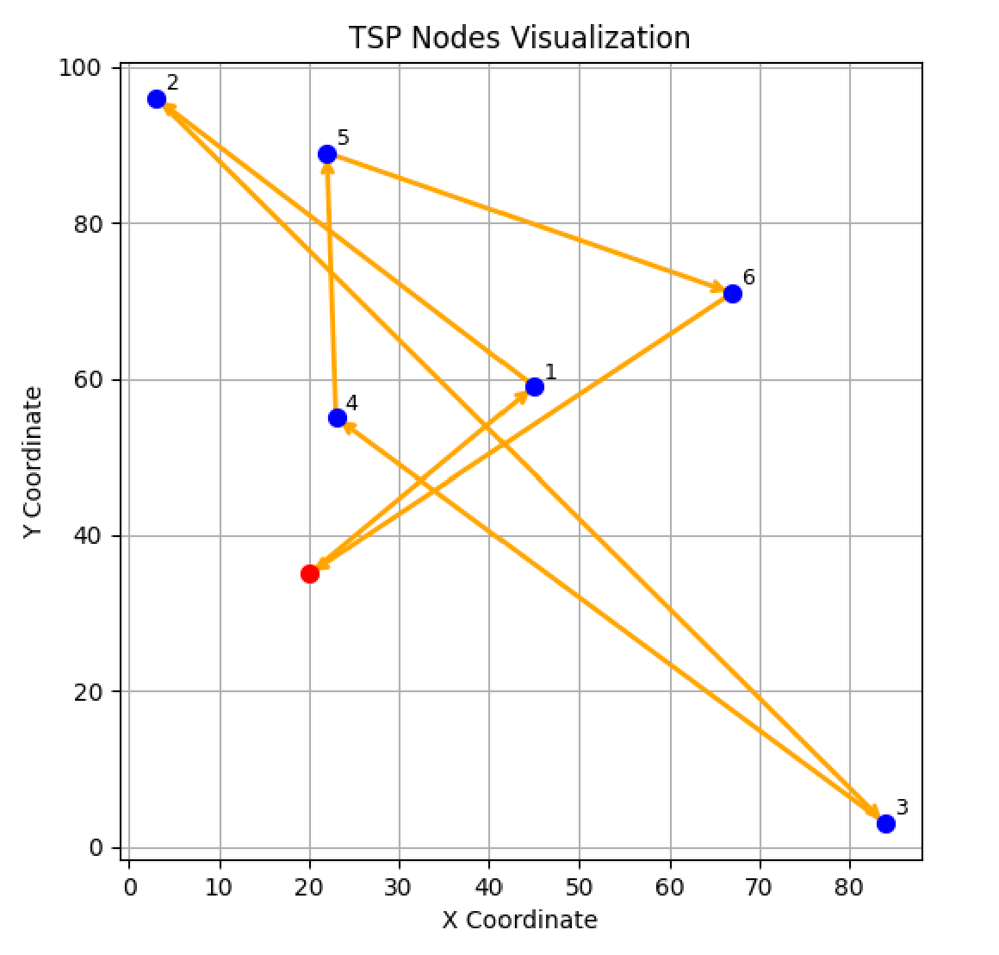

     

  - ISTANZA MEDIA UTILIZZATA:

    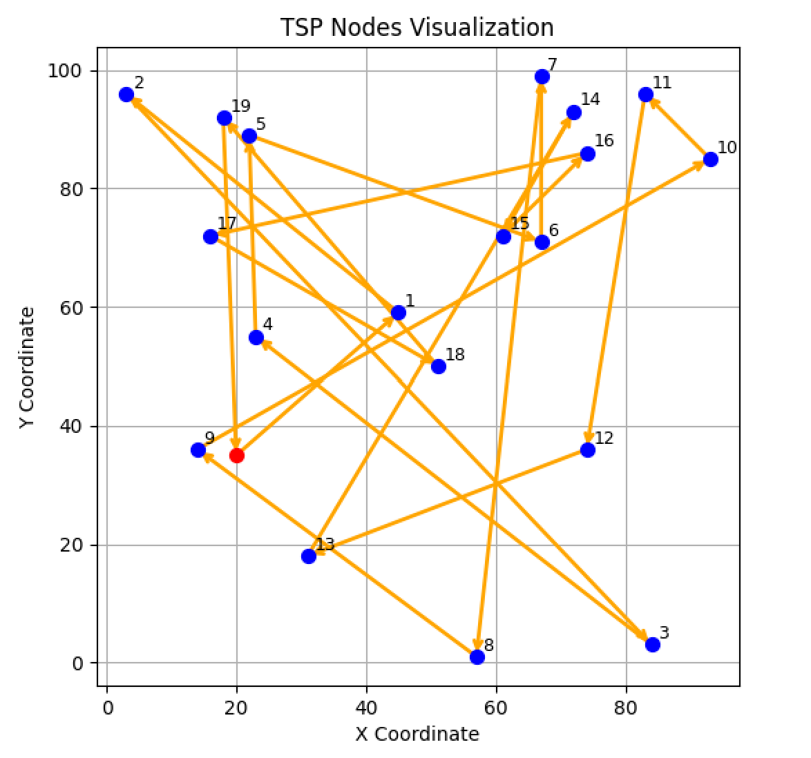

     

  - ISTANZA GRANDE UTILIZZATA:

    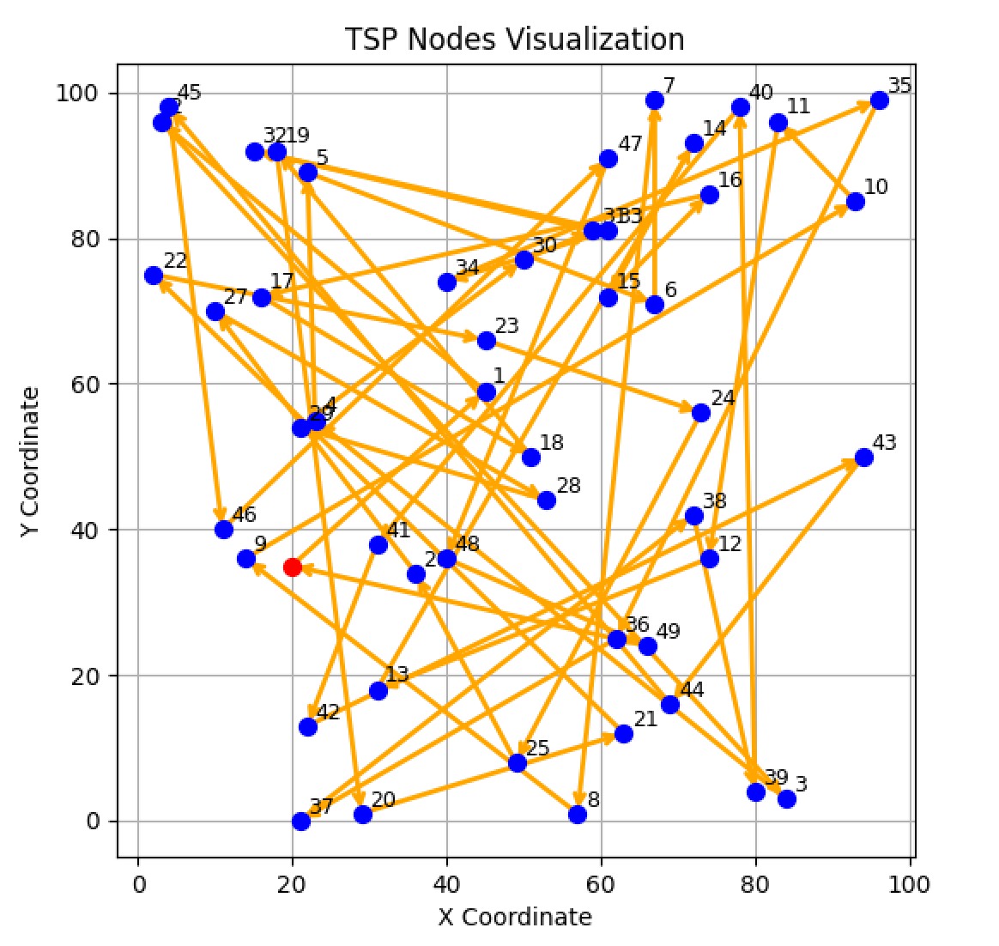

     

## OUTPUT ALGORITMI GREEDY:

  - CONFRONTI GREEDY SULLE DIVERSE ISTANZE:

    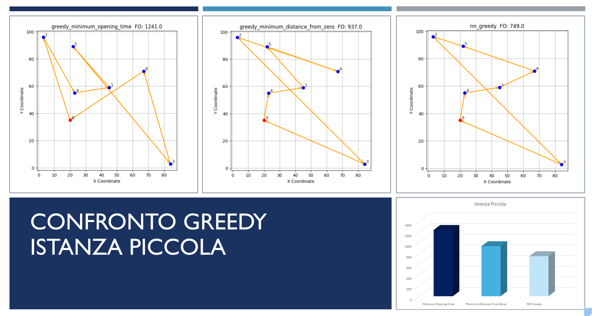

     

    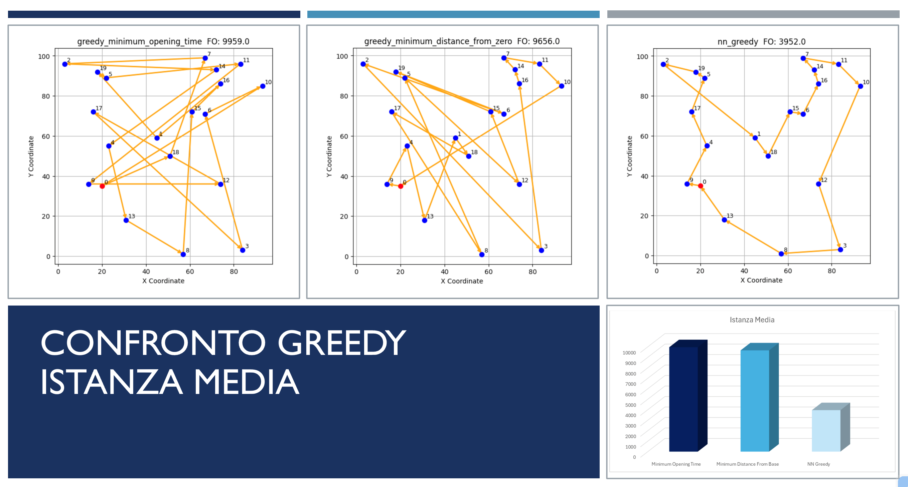

     

    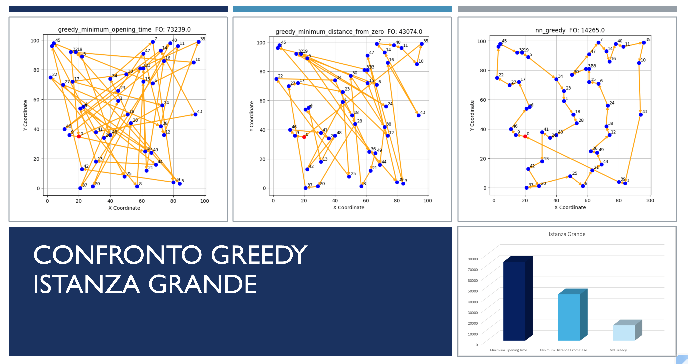

     

## OUTPUT LOCAL SEARCH:

  - LOCAL SEARCH SWAP ADJACENT:

    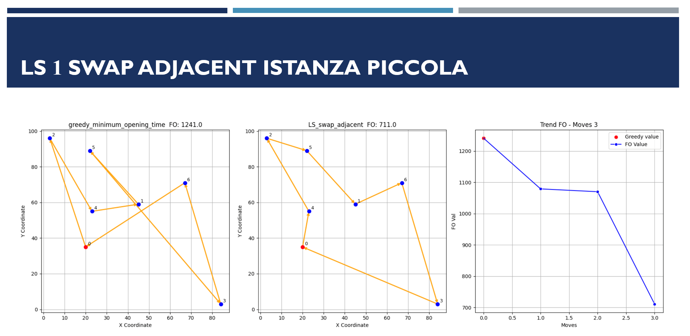

     

    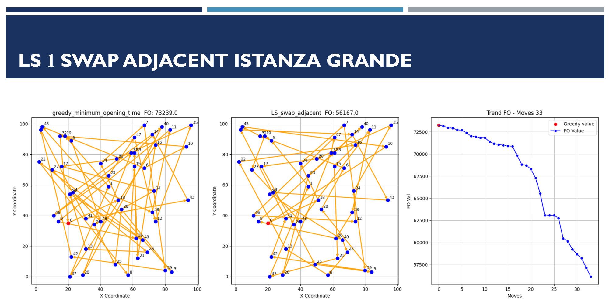

     

  - LOCAL SEARCH CITY INSERT:

    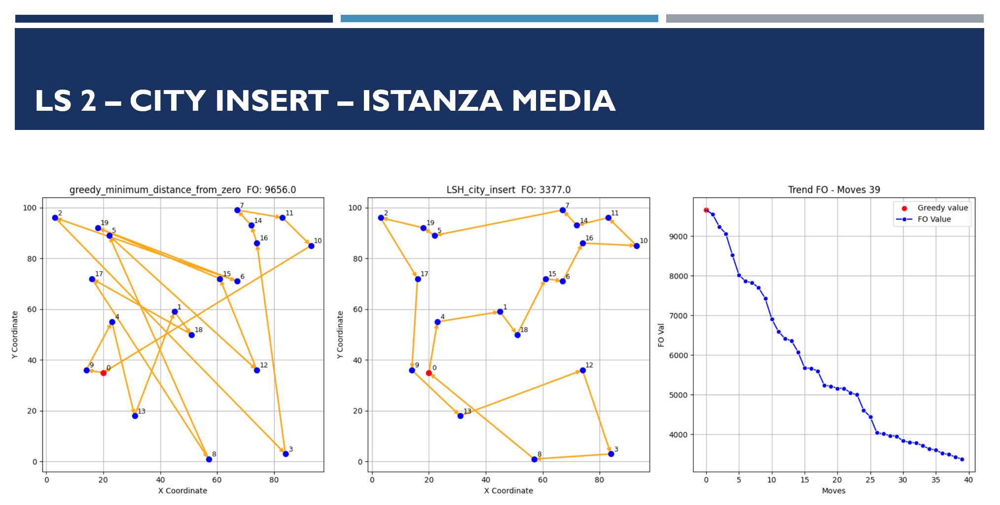

     

    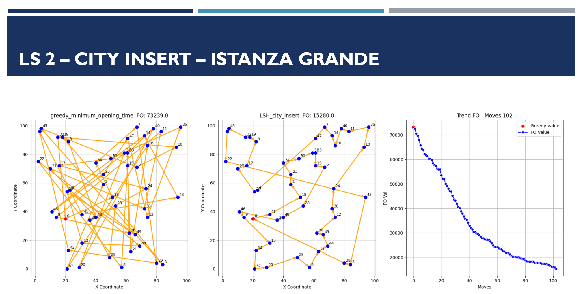

     

  - LOCAL SEARCH CITY INSERT TAIL:

    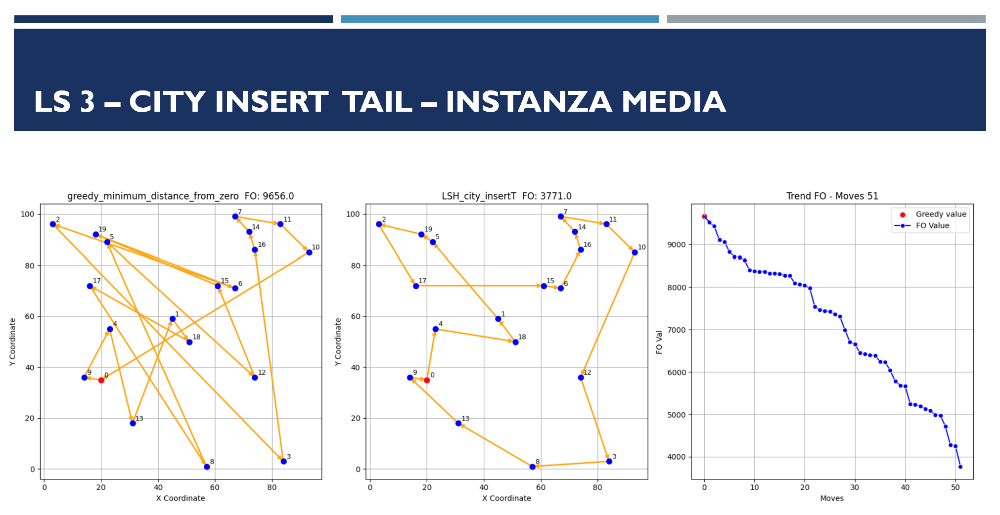

     

    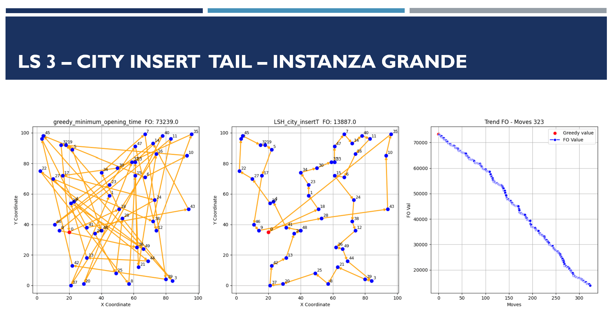

     

## OUTPUT TABU SEARCH:

  - TABU SEARCH INFORMATION GUIDED:

    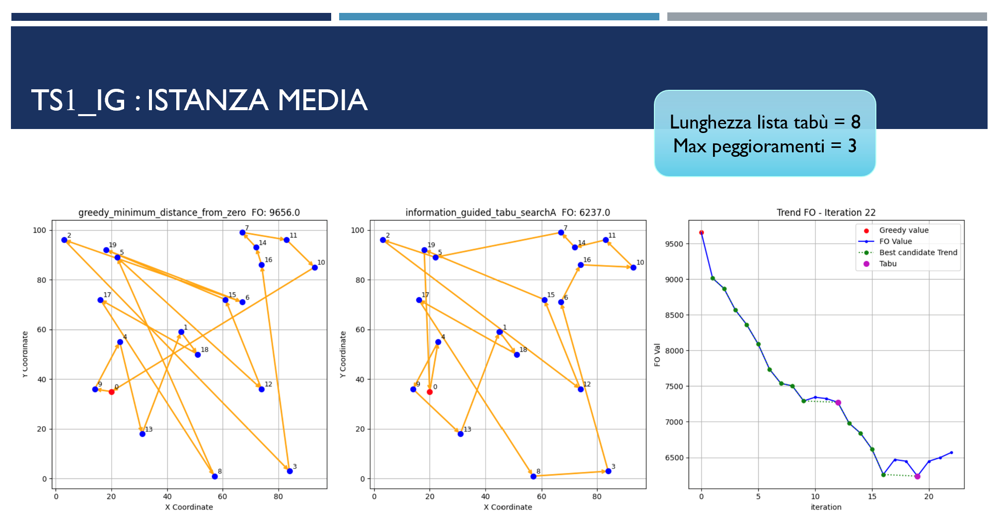

     

    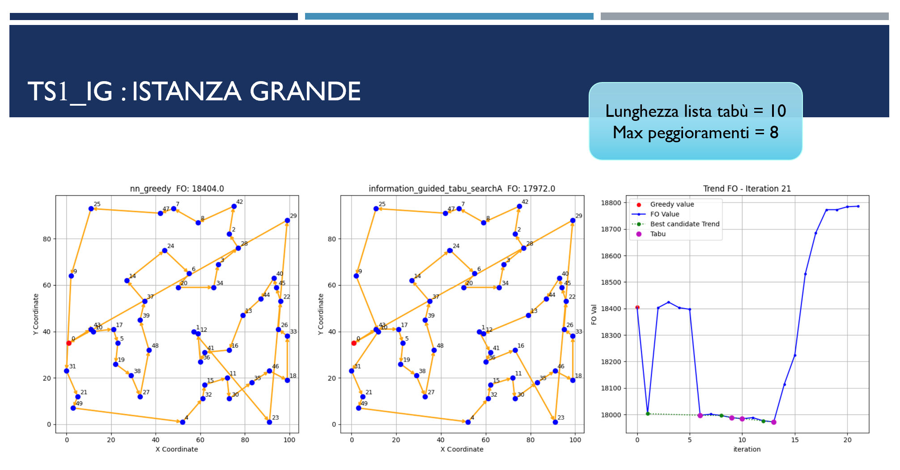

     

  - TABU SEARCH CITY INSERT:

    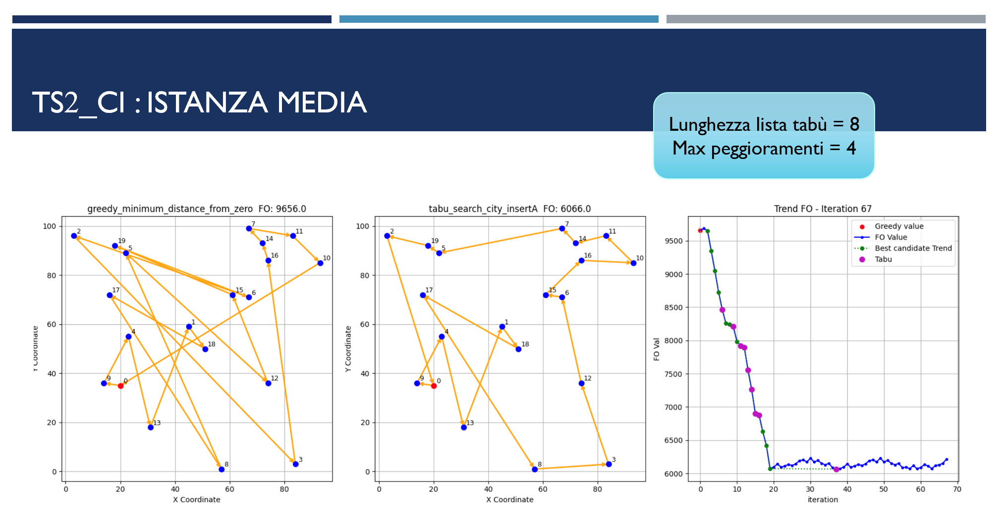

     

    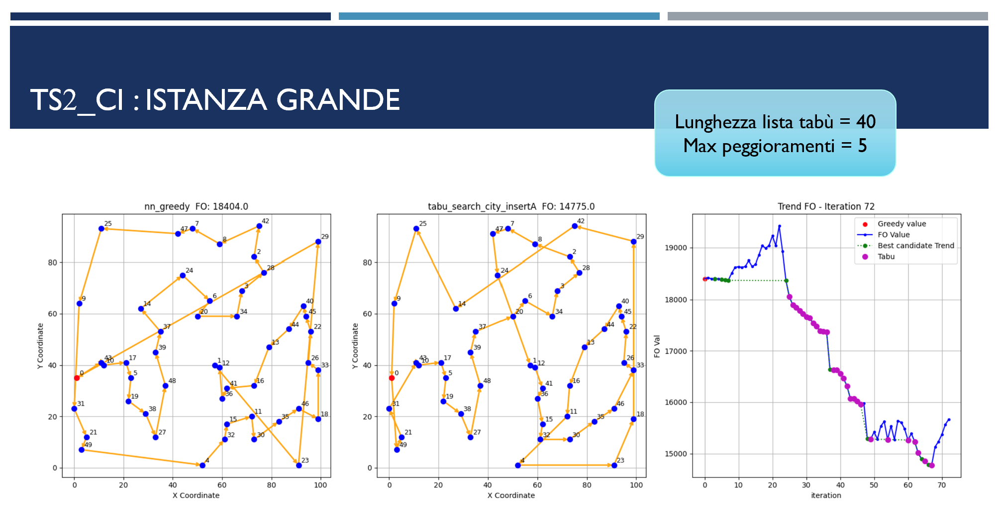

     

## OUTPUT ITERATED LOCAL SEARCH:

  - RISULTATO SULL'ISTANZA MEDIA:

    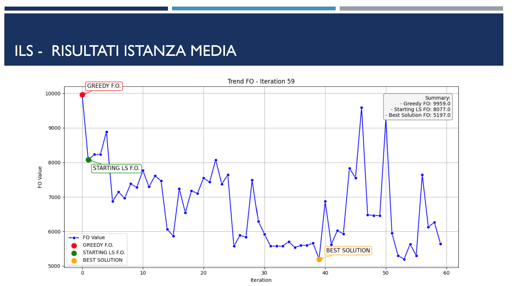

    

